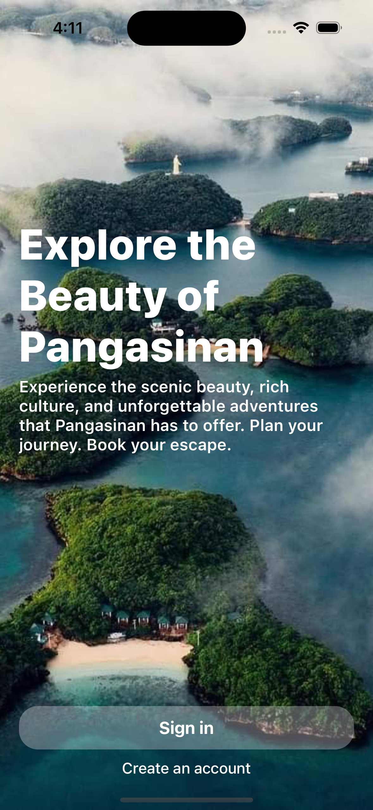
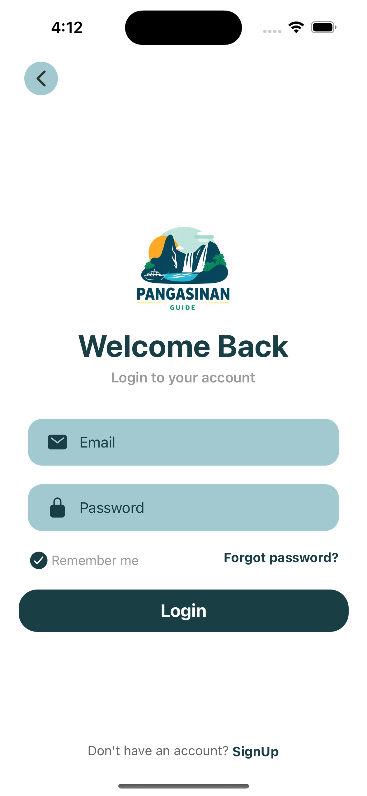
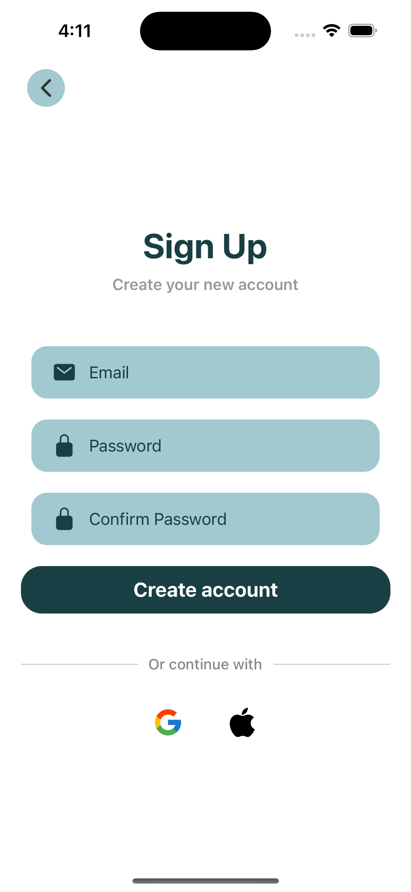
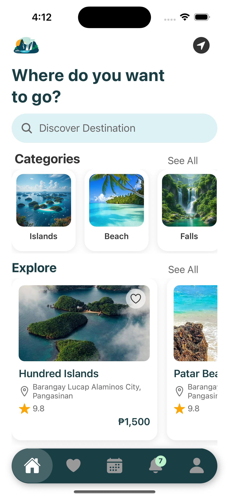
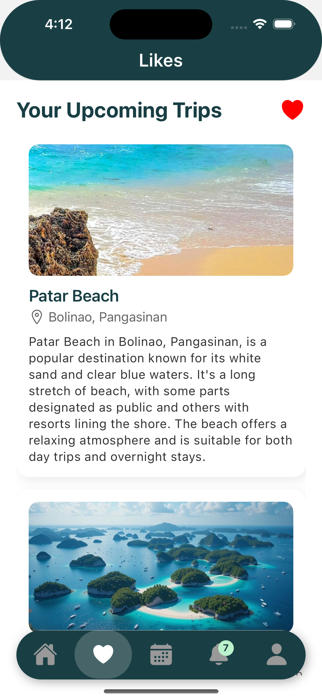
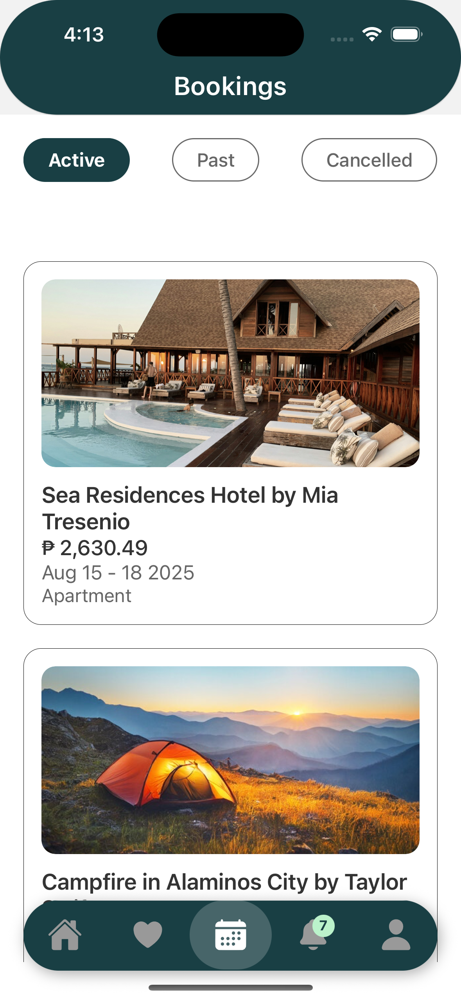
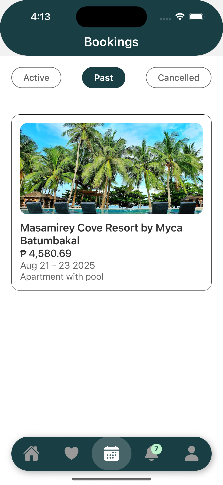
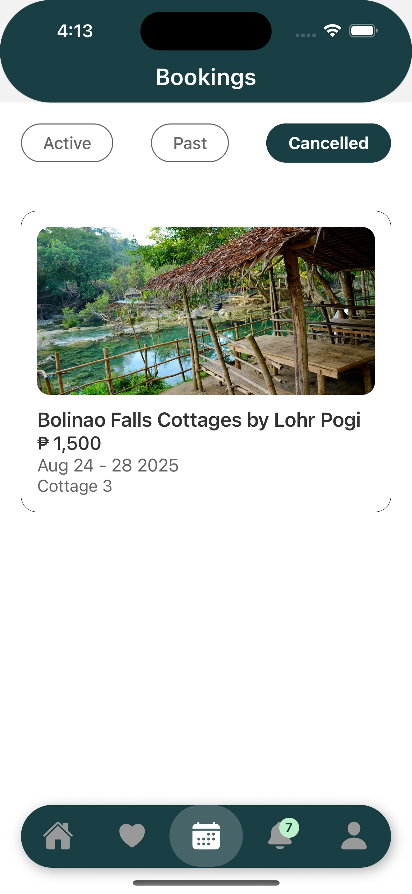
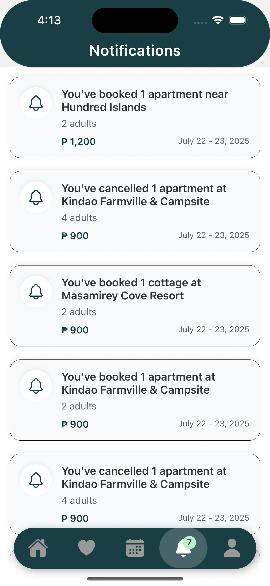
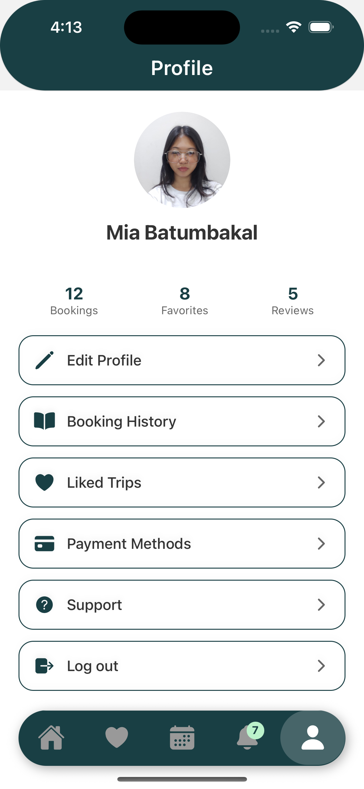

## PangasinanGuide
PangasinanGuide is a simple mobile application designed to help tourists and locals explore the top destinations, cultural heritage, and hidden gems of Pangasinan. This project highlights my skills in mobile app development, UI/UX design, and integration of booking features, making it a valuable part of my developer portfolio.


## Features
- Tourist Destinations – Discover popular spots like Hundred Islands, Bolinao beaches, and Alaminos attractions.
- Booking Integration – Reserve cottages, rooms, or other services from within the app.
- Search & Filter – Easily find destinations by category or location.
- Modern UI/UX – Clean, user-friendly design made with React Native.


## Tech Stack
Frontend: React Native (Expo)
Backend: Firebase Realtime Database (for data storage & authentication) (soon)


## Purpose
This project was developed as part of my portfolio to showcase my ability to design and build functional, user-friendly mobile applications. It combines software engineering with a focus on local tourism promotion, specifically in Pangasinan, Philippines.


## Installation
   ```bash
   git clone https://github.com/miatresenio/PangasinanGuide.git
   ```


Navigate to the project folder:
cd PangasinanGuide

Install dependencies:
npm install

Run the app:
json-server --watch data/db.json --port 8000
npx expo start


## Screenshots













## Developer

Developed by Mia Tresenio


## License

This project is licensed under the [MIT License](./LICENSE).
